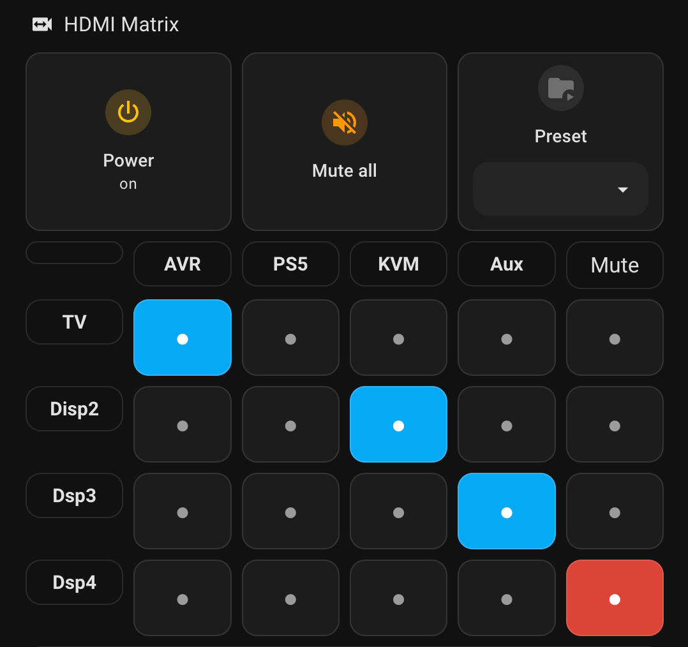

# Gofanco Prophecy 4x4 HDMI Matrix (PRO-Matrix44-SC) Home Assistant Integration

A Home Assistant custom integration that controls the [Gofanco Prophecy 4x4 HDMI Matrix (PRO-Matrix44-SC)](https://www.gofanco.com/4k-hdr-4x4-matrix-with-downscaling-support-pro-matrix44-sc.html) over your local network.


### One-click HACS install

[](https://my.home-assistant.io/redirect/hacs_repository/?owner=gloriousdisaster&repository=Home-Assistant-HDMI-PRO-Matrix&category=Integration)

Click the badge above to add this repo to HACS as a custom repository, or follow the step-by-step installation below.

---

## Features

- **Power** the matrix on and off.
- **Route** any of the 4 HDMI inputs to any of the 4 HDMI outputs (per-output or all outputs at once).
- **Mute** all outputs with a single button, or individual outputs via the per-output media_player.
- **Rename** inputs, outputs, and preset slots from Home Assistant — changes are written back to the matrix.
- **Presets** — save and recall any of 8 routing scenes from the matrix's native preset memory.
- Fully **async** client with a single debounced coordinator (rapid UI interactions collapse to a single refresh).
- **Reconfigure** from the UI if the device's IP changes — no need to delete and re-add.
- **Diagnostics** download from the integration page for support.
- **Media-control dashboard cards** — each output appears as a `media_player` entity for the nicest out-of-the-box UI.

### Entities

| Platform       | Entity                                        | Purpose                                                |
| -------------- | --------------------------------------------- | ------------------------------------------------------ |
| `media_player` | `media_player.hdmi_matrix_output_1`..`_4`     | Power + source picker per output. **Use these first.** |
| `switch`       | `switch.hdmi_matrix_power`                    | Global power toggle.                                   |
| `select`       | `select.hdmi_matrix_output_1`..`_4`           | Routed input per output.                               |
| `select`       | `select.hdmi_matrix_all_outputs`              | Route every output to the same input.                  |
| `select`       | `select.hdmi_matrix_recall_preset`            | Recall a saved scene (1–8).                            |
| `button`       | `button.hdmi_matrix_mute_all_outputs`         | Mute every output at once.                             |
| `text`         | `text.hdmi_matrix_input_1_label`..`_4`        | Rename an input (≤7 chars; stored on the device).      |
| `text`         | `text.hdmi_matrix_output_1_label`..`_4`       | Rename an output (≤7 chars).                           |
| `text`         | `text.hdmi_matrix_preset_1_name`..`_8`        | Rename a preset slot (≤7 chars).                       |

You can rename the device itself in **Settings → Devices & Services → Gofanco Prophecy** (e.g. "Living Room Matrix"); entity IDs will follow automatically on next reload.

### Services

| Service                       | Purpose                                                  |
| ----------------------------- | -------------------------------------------------------- |
| `gofanco_prophecy.save_preset`| Save the matrix's current routing into slot 1–8.         |

---

## Requirements

- **Matrix device**: PRO-Matrix44-SC with IP control enabled and reachable from Home Assistant.
- **Static addressing**: the device's factory default is `192.168.1.92`. Setting a DHCP reservation in your router is strongly recommended; the integration does not automatically discover new IPs.

> [!TIP]
> Changing the factory static IP on the device itself requires a Windows PC, an RS-232 connection, and the manufacturer's control program. It's much easier to pin the address via DHCP reservation.

---

## Installation

### HACS (recommended)

1. Install [HACS](https://hacs.xyz/) if you haven't already.
2. In HACS → **Integrations** → overflow menu → **Custom repositories**, add this repo as an **Integration**.
3. Install **Gofanco Prophecy HDMI Matrix 4x4** from HACS.
4. Restart Home Assistant.
5. **Settings → Devices & Services → Add Integration**, search for **Gofanco Prophecy**.

[](https://my.home-assistant.io/redirect/hacs_repository/?owner=gloriousdisaster&repository=Home-Assistant-HDMI-PRO-Matrix&category=Integration)

### Manual

1. Copy [`custom_components/gofanco_prophecy/`](custom_components/gofanco_prophecy/) into your Home Assistant `config/custom_components/` directory.
2. Restart Home Assistant.
3. **Settings → Devices & Services → Add Integration**, search for **Gofanco Prophecy**.

### Configuration parameters

| Field | Required | Default          | Description                                                 |
| ----- | -------- | ---------------- | ----------------------------------------------------------- |
| Host  | Yes      | `192.168.1.92`   | IP address or hostname of the matrix.                       |
| Port  | No       | `80`             | TCP port (1–65535). Only change if behind a port mapping.   |

The config flow connects to the device and verifies it responds before creating the entry. Errors:

- **Cannot connect** — nothing responded at that address. Check the IP, network, and firewall.
- **Invalid response** — something responded, but it wasn't a Gofanco Prophecy matrix.

### Reconfiguring after an IP change

**Settings → Devices & Services → Gofanco Prophecy → Configure → Reconfigure** and enter the new host. Existing entities, automations, and history are preserved.

### Removal

**Settings → Devices & Services → Gofanco Prophecy → Delete**. If you installed via HACS, you can also uninstall it from HACS afterward.

---

## Dashboard recipes

Stock entities work but don't feel right for a matrix switcher. Three ready-to-paste dashboards ship under [`dashboards/`](dashboards/), each trading dependencies for polish:

| Recipe | HACS dependencies | UX |
|---|---|---|
| **[dashboards/stock.yaml](dashboards/stock.yaml)** | None — stock HA only | Tile cards per output + entities list. Works out of the box. |
| **[dashboards/mushroom.yaml](dashboards/mushroom.yaml)** | [Mushroom](https://github.com/piitaya/lovelace-mushroom) | Compact, modern cards with per-output source picker and preset tiles. |
| **[dashboards/matrix_grid.yaml](dashboards/matrix_grid.yaml)** | [button-card](https://github.com/custom-cards/button-card) | Professional AV-style grid: rows = outputs, columns = inputs, tap a cell to route. Currently-routed cell is highlighted; mute column turns red. |

### How to use

1. Pick a recipe that matches what you've got installed (or install the deps via HACS first).
2. **Settings → Dashboards → ⋮ → Raw configuration editor** (or open an existing dashboard in edit mode → ⋮ → Raw configuration editor).
3. Paste the YAML under a view's `cards:` key, or create a new view with the whole stanza as its content.

### The matrix-grid view (recommended)

The grid mirrors the device itself — one row per output, one column per input:



Each row is an output; each column an input. The highlighted cell is the currently-routed input; tap any other cell in the same row to route that input instead. The right-most column routes the output to mute (input 0) and highlights red when active. Input/output labels come from the `text.hdmi_matrix_*_label` entities, so renaming a source updates the header cell instantly.

## Blueprints

The repo ships four automation blueprints under [`blueprints/automation/gofanco_prophecy/`](blueprints/automation/gofanco_prophecy/). Click a button below to import one into your Home Assistant:

| Blueprint | What it does | Import |
| --- | --- | --- |
| **Recall preset** | On any trigger, recalls a saved preset scene by slot name. | [](https://my.home-assistant.io/redirect/blueprint_import/?blueprint_url=https%3A%2F%2Fgithub.com%2Fgloriousdisaster%2FHome-Assistant-HDMI-PRO-Matrix%2Fblob%2Fmain%2Fblueprints%2Fautomation%2Fgofanco_prophecy%2Frecall_preset.yaml) |
| **Auto-route media source** | When a chosen media_player starts playing, routes its input to a chosen matrix output. | [](https://my.home-assistant.io/redirect/blueprint_import/?blueprint_url=https%3A%2F%2Fgithub.com%2Fgloriousdisaster%2FHome-Assistant-HDMI-PRO-Matrix%2Fblob%2Fmain%2Fblueprints%2Fautomation%2Fgofanco_prophecy%2Fauto_route_media.yaml) |
| **Save current routing as preset** | On any trigger, saves the matrix's current routing into one of the 8 preset slots. | [](https://my.home-assistant.io/redirect/blueprint_import/?blueprint_url=https%3A%2F%2Fgithub.com%2Fgloriousdisaster%2FHome-Assistant-HDMI-PRO-Matrix%2Fblob%2Fmain%2Fblueprints%2Fautomation%2Fgofanco_prophecy%2Fsave_preset.yaml) |
| **Mute all outputs on event** | On any trigger, fires the mute-all button. | [](https://my.home-assistant.io/redirect/blueprint_import/?blueprint_url=https%3A%2F%2Fgithub.com%2Fgloriousdisaster%2FHome-Assistant-HDMI-PRO-Matrix%2Fblob%2Fmain%2Fblueprints%2Fautomation%2Fgofanco_prophecy%2Fmute_all.yaml) |

Or import manually: **Settings → Automations & Scenes → Blueprints → Import Blueprint** and paste one of these URLs:

```
https://github.com/gloriousdisaster/Home-Assistant-HDMI-PRO-Matrix/blob/main/blueprints/automation/gofanco_prophecy/recall_preset.yaml
https://github.com/gloriousdisaster/Home-Assistant-HDMI-PRO-Matrix/blob/main/blueprints/automation/gofanco_prophecy/auto_route_media.yaml
https://github.com/gloriousdisaster/Home-Assistant-HDMI-PRO-Matrix/blob/main/blueprints/automation/gofanco_prophecy/save_preset.yaml
https://github.com/gloriousdisaster/Home-Assistant-HDMI-PRO-Matrix/blob/main/blueprints/automation/gofanco_prophecy/mute_all.yaml
```

After import, create an automation from the blueprint in the **Automations** UI — it'll walk you through picking a trigger and filling in the matrix-specific inputs.

### Sample automations

**Route to the TV when the Apple TV wakes up:**
```yaml
trigger:
  - platform: state
    entity_id: media_player.apple_tv
    to: "playing"
action:
  - service: media_player.select_source
    target:
      entity_id: media_player.hdmi_matrix_output_1
    data:
      source: AppleTV
```

**Save the current routing as "Movie night" (preset 1):**
```yaml
action:
  - service: gofanco_prophecy.save_preset
    data:
      index: 1
  - service: text.set_value
    target:
      entity_id: text.hdmi_matrix_preset_1_name
    data:
      value: Movie
```

**Recall "Movie night" on a button press:**
```yaml
action:
  - service: select.select_option
    target:
      entity_id: select.hdmi_matrix_recall_preset
    data:
      option: "1: Movie"
```

---

## Upgrading from 2.0.x

2.1.0 shortens entity IDs (dropping the IP from them, e.g. `switch.hdmi_matrix_10_200_4_204_power` → `switch.hdmi_matrix_power`) and adds new platforms for media_player and presets.

**What to expect on first load:**

- New `media_player`, preset-recall `select`, and preset-name `text` entities appear.
- Existing entities get renamed. Home Assistant will **register them under the new IDs automatically** — old ones become orphans in the entity registry (delete them from **Settings → Devices & Services → Entities** if you want a clean list).
- Automations that referenced the old long IDs need to be updated — the **Search & Replace** in Developer Tools → YAML is the fastest fix.

**Nothing in your config file needs manual editing** for the integration itself; only dashboard/automation references to the old entity IDs.

## Upgrading from 1.x

2.0.0 was a full rewrite:

- Entity `unique_id`s derive from the config entry, not the IP address, so renumbering IPs no longer orphans entities.
- Entities use `has_entity_name` + translation keys.
- Config-entry data key renamed `ip_address` → `host`; old entries are migrated automatically on first load.

HA will re-register entities on first load — no manual action required.

---

## How it works

The matrix runs a small embedded HTTP/1.0 server at port 80. The integration opens raw TCP connections (aiohttp can't parse the device's quirky HTTP/1.0 replies) and speaks `POST /inform.cgi?<cmd>` with the same `<cmd>` as the body. The same wire format the device's own web UI uses.

### `curl` reference

```bash
# Get full state
curl --http0.9 -X POST "http://IP/inform.cgi?param1:1" \
     -H "Content-Type: application/json" \
     -d '{"param1":"1"}'

# Mute all outputs
curl --http0.9 -X POST "http://IP/inform.cgi?outa=0" -d 'outa=0'

# Fetch the 8 preset names
curl --http0.9 -X POST "http://IP/inform.cgi?LOADMAP" -d 'LOADMAP'

# Recall preset 3
curl --http0.9 -X POST "http://IP/inform.cgi?call=3" -d 'call=3'
```

### Payload reference

| Payload               | Purpose                                              |
| --------------------- | ---------------------------------------------------- |
| `{"param1":"1"}`      | Query routing state + I/O labels + power             |
| `LOADMAP`             | Fetch preset names (`namem1`..`namem8`)              |
| `LOADNAME`            | Fetch I/O labels only                                |
| `out<N>=<I>`          | Route output `N` (1–4) to input `I` (0–4; 0 = mute)  |
| `outa=<I>`            | Route all outputs to input `I`                       |
| `namein<N>?<name>?`   | Rename input `N` (≤7 characters)                     |
| `nameout<N>?<name>?`  | Rename output `N` (≤7 characters)                    |
| `mname<N>?<name>?`    | Rename preset slot `N` (≤7 characters)               |
| `save=<N>`            | Save current routing into preset slot `N`            |
| `call=<N>`            | Recall preset slot `N`                               |
| `poweron` / `poweroff`| Power control                                        |

---

## Known limitations

- The device only persists 7-character labels (inputs, outputs, presets). Longer names are silently truncated.
- There is no network discovery; the IP must be entered manually.
- The device has no authentication, so any host on the network can control it. Consider network segmentation if this matters to you.
- Standby / lock state and EDID settings are **not** exposed — the device's firmware doesn't report these over the HTTP endpoint, so we have no reliable read path.
- The global power is shared across all outputs — per-output `media_player.turn_on`/`off` drives the whole matrix.

---

## Contributing

See [CONTRIBUTING.md](CONTRIBUTING.md). Report bugs and request features via the [issue tracker](https://github.com/gloriousdisaster/Home-Assistant-HDMI-PRO-Matrix/issues).

## License

[MIT](LICENSE). No warranty; use at your own risk.
